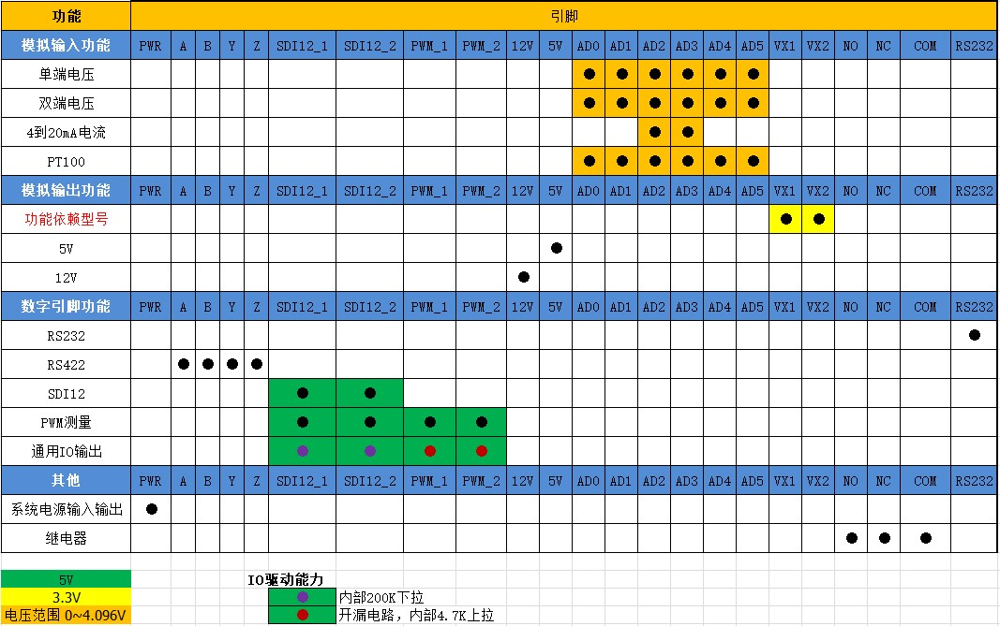

==================================
智能数据采集仪使用说明书
==================================

 |device| 是一款多用途低功耗的可以二次开发的数据采集采集仪。通过控制脚本，数据采集仪可以测量多数的水文、气象、环境和工业领域的传感器。

 数据采集仪可以保存60000条数据采集结果。超过60000条数据后，将自动擦除最先保存的数据。

 数据采集仪可以按照预设的时间间隔进行数据采集，也可以按照预设的时间间隔唤醒设备进行数据上传。两种预设间隔独立执行，数据采集仪可以通过多种通信方式将数据上传到指定网站。

 |device| 根据通信方式不同，包含以下型号：

        ======  =========       =========
        序号    型号            通信方式
        ======  =========       ========= 
        1       SDL-1000W       WIFI
        2       SDL-1000G       GPRS
        3       SDL-1000N       NBIOT
        4       SDL-1000L       LORA
        ======  =========       =========

 |device| 采用统一硬件，独立软件的组织方式，可以有效降低硬件采购成本，提高部署简易度，真正实现一款硬件采集任意多种传感器数据并上传。

--------------------------------
安全警告
--------------------------------

 在安装、使用、维护以及在三脚架，高墙附近工作过程中都会产生很多危险，特别是某些建筑物带有一些附属设施，比如传感器，交叉悬臂，外壳以及天线等。请勿在恶劣天气下进行任何工作。 
 
 未能合适完整的错误组装、安装、操作、使用和维护设备，以及不遵守安全警告，都将增加死亡，严重伤害，财产损失与设备损坏的风险。在进行现场安装工作之前，请先获取必需的批准和许可。尽量使用制造商推荐的零件，材料和工具。 
 
 务必采取一切合理的预防措施以避免这些危险。在执行任何工作之前，仔细阅读安全规程和检查所需的保护设施，遵守所有电气规范。电气设备和相关的接地装置应该是由有执照的合格的电工安装，以免发生意外事故。
 
 对于室外或潮湿环境推荐配备防水箱一起使用。

----------------------------------
使用须知
----------------------------------
 在使用的过程中，需注意以下几点：

        #. 供电请勿超过电压值。正常供电电压范围为：9V~24V
        #. 请远离水，潮湿等地方
        #. 请远离静电

----------------------------------
设备概览
----------------------------------

^^^^^^^^^^^^^^^^^^^^^^^^
接线端子布局
^^^^^^^^^^^^^^^^^^^^^^^^
.. figure:: ../_static/top_view.png
   :align: center

^^^^^^^^^^^^^^^^^^^^^^^^
端子功能映射
^^^^^^^^^^^^^^^^^^^^^^^^

请按照指定功能连接传感器

^^^^^^^^^^^^^^^^^^^^^^^^
安装设备
^^^^^^^^^^^^^^^^^^^^^^^^
 |device| 以及相关的外设必须保证在干燥环境下使用。带电的潮湿环境将会严重损害设备。一般情况下，把设备放在防水箱里，并放置一些干燥剂，就可以有效防潮。干燥剂需要每隔一段时间重新更换。

^^^^^^^^^^^^^^^^^^^^^^^^
系统供电
^^^^^^^^^^^^^^^^^^^^^^^^
 系统供电电压范围：9～24V Dc。
 系统可以通过2种方式供电：

                - 正面PWR端子。
                - 侧面DC5.0接口。

^^^^^^^^^^^^^^^^^^^^^^^^
设备接地
^^^^^^^^^^^^^^^^^^^^^^^^
 有效接地能够很好的提高设备安全性，释放瞬间的电击。在野外，最简易的接地方式是使用14AWG的导线连接埋入大地的5脚铜质护套。

------------------------
测量功能
------------------------

^^^^^^^^^^^^^^^^^^^^^^^^
数字总线测量
^^^^^^^^^^^^^^^^^^^^^^^^

""""""""""""""""""""""""
RS422/RS485自定义协议
""""""""""""""""""""""""
 |device| 提供满足RS422协议的总线采集功能。如果使用RS485协议，可以先连接采集仪的A-Y， B-Z，再连接传感器。
 
 串行波特率最大为 921600。 
 
 脚本函数为： ``rs422_send``

 相关端子为：  ``A - B - Y - Z``
 
.. figure:: ..\_static\rs422_hw_ref.jpg
        :align: center
 

""""""""""""""""""""""""
MODBUS协议
""""""""""""""""""""""""

 |device| 提供的MODBUS协议采集是基于 RS422总线和端子。当前采集仪仅支持 MODBUS RTU协议。
 
 串行波特率最大为 921600。
 
 脚本函数为： ``modbus_send``
 
 相关端子为：  ``A - B - Y - Z``

""""""""""""""""""""""""
RS232自定义协议
""""""""""""""""""""""""

 |device| 提供满足RS232协议的总线采集功能。仅支持TX RX GND3个引脚。

 串行波特率最大为 921600

 脚本函数为： ``rs232_send``

 相关端子为： ``DB9接口``

.. figure:: ..\_static\rs232_hw_ref.jpg
        :align: center

""""""""""""""""""""""""
SDI12协议
""""""""""""""""""""""""
 |device| 提供2个通道，满足SDI12 1.3协议的总线采集功能。

 脚本函数为： ``sdi12_1_send`` ， ``sdi12_2_send``

 相关端子为： ``SDI12_1，SDI12_2``

.. figure:: ..\_static\sdi12_hw_ref.jpg
        :align: center

^^^^^^^^^^^^^^^^^^^^^^^^
模拟信号测量
^^^^^^^^^^^^^^^^^^^^^^^^
""""""""""""""""""""""""
电压测量
""""""""""""""""""""""""
 |device| 提供6个通道的 单端 电压测量以及 3对 差分电压测量。 24bit分辨率， 量程 0~4.096V。

 脚本函数为： ``vol_sigle_get`` , ``vol_diff_get``

 相关端子为： ``AD0`` , ``AD1`` , ``AD2`` , ``AD3`` , ``AD4`` , ``AD5``

 参考连接电路：

        单端电压测量

        .. figure:: ..\_static\vol_single_get_4.096.jpg
                :align: center

                输出电压小于4.096V

        
        .. figure:: ..\_static\vol_single_get_10.jpg
                :align: center

                输出电压 0 ~ 10V

        差分电压测量

        .. figure:: ..\_static\vol_diff_get.jpg
                :align: center

                

""""""""""""""""""""""""
电流测量
""""""""""""""""""""""""
 |device| 提供2个通道的电流测量。 24bit分辨率， 量程 4 ~ 20mA。

 脚本函数为： ``current_get`` 

 相关端子为： ``AD2`` , ``AD3`` 

 参考连接电路：

        .. figure:: ../_static/current_get.jpg
                :align: center

.. warning:: 仅 ``AD2`` , ``AD3`` 具有电流测量功能。

""""""""""""""""""""""""
热电阻测量
""""""""""""""""""""""""
 |device| 可以进行一通道 PT100热电阻测量。支持三线式 和 四线式 PT100传感器。

 脚本函数为： ``pt100_3wire_get`` , ``pt100_4wire_get``

 相关端子为： ``AD0`` , ``AD1`` , ``AD2`` , ``AD3`` , ``AD4`` , ``AD5``

 参考连接电路：

    三线式PT100传感器

        .. figure:: ..\_static\pt100_3wire_get.jpg
                :align: center

    四线式PT100传感器

        .. figure:: ..\_static\pt100_4wire_get.jpg
                :align: center

.. note:: 请注意连接端子 与 脚本函数参数的对应关系

^^^^^^^^^^^^^^^^^^^^^^^^
数字电平测量
^^^^^^^^^^^^^^^^^^^^^^^^
 引脚“SDI12_1”，“SDI12_2”，“PWM_1”，“PWM_2”，可以复用为数字输入输出。电压范围为0～5V。注意一旦这些引脚正在进行其他功能，则“数字输入输出”功能无效。

 数字输入输出功能可以使用如下函数： 

                - ``output_set(io_channel,io_value)``  输出高低电平
                - ``input_get(io_channel)``            获取高低电平

 相关端子为：

                ``SDI12_1`` , ``SDI12_2`` , ``PWM_1`` , ``PWM_2``

.. warning:: 数字输出时，驱动能力较弱。电流消耗较大的场合，请扩展驱动电路。

^^^^^^^^^^^^^^^^^^^^^^^^
脉冲计数与频率
^^^^^^^^^^^^^^^^^^^^^^^^
 |device| 可以进行 4个通道的低频计数功能。低频计数时，不需要指定时间，一旦 ``pwm_start`` 计数开始，每当引脚端子监测到上升沿，对应 计数值增一。可以在任意 ``on_start``
 执行时，通过 ``pwm_get`` 获取计数。低频计数不受设备休眠影响。可以通过 ``pwm_stop`` 停止计数，也可以通过 ``pwm_set`` 重置计数。计数范围：0 ~ 2^32 。

 低频计数相关端子：  ``PWM_1`` , ``PWM_2`` ,  ``SDI12_1`` **脚本中使用PWM_3**, ``SDI12_2`` **脚本中使用PWM_4**

 |device| 可以进行 2个通道的高频计数功能。高频计数需要指定一个时间段，统计一个时间段内的总的脉冲个数。通常用于频率测量。由于测量时隙内，回调函数返回之前，设备无法休眠，将导致功耗增大，所以请合理选择测量时间。

 高频计数函数： ``pulse1_count_start`` , ``pulse2_count_start``

 高频计数相关端子: ``PWM_1`` , ``PWM_2``

.. note:: 低频测量时，对于机械式脉冲传感器，比如翻斗式雨量筒， 为避免机械接触时产生的抖动导致的误计数， 可以在测量引脚端子与GND之间并联 0.1uF ~ 1uF的电容。

.. note:: 对于 ``PWM_1`` ``PWM_2`` 端子，内部已经通过4.7K电阻上拉至5V，所以可以直接连接机械式脉冲传感器 和 NPN型 开漏输出传感器，不需要额外电路。

.. figure:: ..\_static\pwm_get.jpg
        :align: center

------------------------
时间较准与获取
------------------------
 |device| 内部集成了高精度RTC芯片，每年误差不超过3s。每24小时自动从网侧同步一次时间。
 可以使用如下函数获取不同格式的系统时间：

                - ``datetime()``     获取当前时间字符串“YYYY-MM-DD HH:mm:SS”
                - ``timestamp()``    获取UNIX timestamp
                - ``bcdtime()``      获取BCD格式的时间字符数组，主要用于数据上传

 通过上位机也可以设置采集仪系统时间。

------------------------
辅助功能
------------------------
^^^^^^^^^^^^^^^^^^^^^^^^
电源电压
^^^^^^^^^^^^^^^^^^^^^^^^
 |device| 支持电源电压测量，用于故障检测。
 可以使用 ``sys_power_vol()`` 函数进行控制。 返回值为当前电源电压的10倍。

^^^^^^^^^^^^^^^^^^^^^^^^
继电器控制
^^^^^^^^^^^^^^^^^^^^^^^^
 |device| 提供一路继电器控制，用于自动化控制。比如，传感器数值超限时，自动断开电源，或启动伺服等。
 可以使用 ``relay(onoff)`` 函数进行控制。
 相关端子为：

                - NC   继电器常闭引脚
                - COM  继电器通用引脚
                - NO   继电器常开引脚

^^^^^^^^^^^^^^^^^^^^^^^^
数据存储器
^^^^^^^^^^^^^^^^^^^^^^^^
 |device| 内部可以提供多达60000条的数据存储，直到确保采集数据被上传到服务器。超过60000条数据后，将自动擦除最先采集的数据。

 |device| 同时支持SD卡 数据导出功能。导出格式为 csv格式。

^^^^^^^^^^^^^^^^^^^^^^^^
缓存存储器
^^^^^^^^^^^^^^^^^^^^^^^^
 为了实现依赖历史数据的特定算法， |device| 提供 512个number型数据缓存区，以及512字节的table变量缓存区。缓存区数值可以在每次执行脚本时 设置和读取。 缓冲区数据掉电丢失。

-----------------------
闪电保护
-----------------------
 雷击可能会损坏或破坏 |device| 和相关的传感器和电源

 最常见破坏性的静电放电主要是雷击。 首先是雷电直接击中仪器设备，其次是感应电力线或者连接到电线的其他电压仪器和设备。虽然市场上精密的闪电保护系统是十分可靠的，但是价格确十分昂贵。本公司多年来已经研制出一种简单而便宜的设计，可以保护绝大多数系统。该系统采用避雷针，金属桅杆，重型号接地线和接地棒，以引导和疏离损坏的 |device| 电流。但这个方法也并非是无懈可击的。

 下图是一个典型的图系统的应用  。

.. figure:: ../_static/lightning.png
   :align: center

-----------------------
数据上传
-----------------------
 |device| 支持TCP,UDP,LORA,NBIOT 几种协议上传。
 
 目前上传协议支持：

        - 天星智联 UDP
        - 庆云 TCP
        - Onenet TCP

 定制协议或详细协议信息，请咨询客服。

.. |device| replace:: 智能数据采集仪
