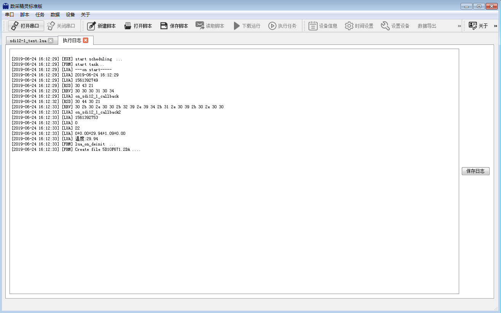
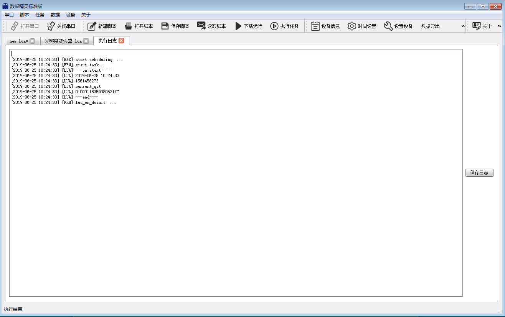

========================
工程示例
========================

-------------------------
SDI-12土壤温湿度传感器
-------------------------
 通过基站式智能数据采集仪连接SDI-12土壤温湿度传感器，采集传感器数据并解析，通过上位机执行测试脚本显示出具体温度等信息。

^^^^^^^^^^^^^^^^^^^^^^^^
传感器参考
^^^^^^^^^^^^^^^^^^^^^^^^
 官方网站： http://www.acclima.com

 :download:`传感器Datasheet <../_static/User Manual SDI and SDIP TDT.pdf>`

^^^^^^^^^^^^^^^^^^^^^^^^
连接参考
^^^^^^^^^^^^^^^^^^^^^^^^
 将SDI-12土壤温湿度传感器红色端连接基站式智能数据采集仪PWR端子、白色端连接GND端子、蓝色端连接SDI12-1或者SDI12-2端子。

 .. figure:: ..\_static\sdi12_sc_ref.png
        :align: center
        
        参考连接

^^^^^^^^^^^^^^^^^^^^^^^^
脚本参考
^^^^^^^^^^^^^^^^^^^^^^^^

 .. code-block:: lua
        :linenos:
        

        function on_config()
        end

        function on_sdi12_1_callback2(status,data) 
                print('on_sdi12_1_callback2')
                print(timestamp())
                print(status)
                print(#data)
                if status == 1 then
                        print("response timeout")
                end
                if status == 2 then
                        print("receive data error")
                end
                if status < 0 then 
                        return 
                end
                if #data == 0 then 
                        return
                end
                
                ds = ""
                for k,v in pairs(data) do
                        ds = ds..string.char(v)
                end

                print(ds)
                f,l,address,ec,vwc,t = string.find(ds,"(%d+)+(%d+.%d+)+(%d+.%d+)(.%d+.%d+).*")    --数据解析
                vwc1 = tonumber(vwc)
                print('温度:'..vwc1)                                                  --输出采集温度大小
                add_data_item(8,1,'FLOAT',vwc1)
        end

        function on_timeout1() 
                sdi12_1_send({48,68,48,33},3,on_sdi12_1_callback2)                    --发送0D0！
        end

        function on_sdi12_1_callback(status,data)
                print('on_sdi12_1_callback')
                delay_call(3,on_timeout1)                                              --延时3s
        end

        function on_start()
                print('---on start-----')
                print(datetime())
                print(timestamp())
                add_data_item(0,1,'UCHAR',12) 
                add_data_item(0,2,'UCHAR',23) 
                add_data_item(0,3,'BCD_YYMMDDHHMM',bcdtime()) 
                sdi12_1_send({48,67,33},3,on_sdi12_1_callback)                        --发送0C！，延时3s
        end
        
^^^^^^^^^^^^^^^^^^^^^^^^
执行log
^^^^^^^^^^^^^^^^^^^^^^^^

    
-------------------------
Pt100三线铂电阻
-------------------------
 测量3线铂电阻的真实阻值。

^^^^^^^^^^^^^^^^^^^^^^^^
传感器参考
^^^^^^^^^^^^^^^^^^^^^^^^
 

^^^^^^^^^^^^^^^^^^^^^^^^
连接参考
^^^^^^^^^^^^^^^^^^^^^^^^
 Pt100铂电阻引出三线，Pt100接线时电流回路的参考和电压测量回路的参考为一条线（即检测设备的I-端子和V-端子短接）。

 .. note:: 蓝色线连接通道对应脚本函数 ``pt100_3wire_get`` 第一个参数。红色线之一必须连接于 ``AD2`` 或 ``AD3`` 端子，并且 ``pt100_3wire_get`` 第三个参数必须为 ``AD2`` 或 ``AD3``

 .. figure:: ..\_static\pt100_3wire_sc_ref.png
        :align: center
        
        参考连接

^^^^^^^^^^^^^^^^^^^^^^^^
脚本参考
^^^^^^^^^^^^^^^^^^^^^^^^

 .. code-block:: lua
        :linenos:
        

        function on_config()
        end

        function on_start()
                print('---on start-----')
                print(datetime())
                print(timestamp())
                print('pt100_3wire_get')

                resistance = pt100_3wire_get('AD0','AD5','AD2')
                print('铂电阻值:'..resistance)

                temp = pt100_temperature('PT100',resistance)
                print('温度值:'..temp)
                
                print('---end----')
        end
        
        
^^^^^^^^^^^^^^^^^^^^^^^^
执行log
^^^^^^^^^^^^^^^^^^^^^^^^

.. figure:: ..\_static\pt100_3wire_log.png
        :align: center

.. note:: 
        四线PT100热电阻传感器，蓝色端子对应 ``pt100_4wire_get`` 的第1和第2参数，红色端子对应与第3和第4参数。
        并且，第4参数通道必须为 ``AD2`` 或 ``AD3`` 之一。

-------------------------
Modbus温湿度变送器
-------------------------
 通过基站式智能数据采集仪连接485温湿度变送器，采集传感器数据并解析，通过上位机执行测试脚本显示出空气中温度值和湿度值

^^^^^^^^^^^^^^^^^^^^^^^^
传感器参考
^^^^^^^^^^^^^^^^^^^^^^^^
 

^^^^^^^^^^^^^^^^^^^^^^^^
连接参考
^^^^^^^^^^^^^^^^^^^^^^^^
 485温湿度变送器红色线接PWR端子、黑色线接GND端子，将基站式智能数据采集仪AY、BZ端子短接后，将485温湿度变送器黄色线接到基站式智能数据采集仪A端子处、白色线接在B端子处。

 .. figure:: ..\_static\rs422_sc_ref.png
        :align: center
        
        参考连接

^^^^^^^^^^^^^^^^^^^^^^^^
脚本参考
^^^^^^^^^^^^^^^^^^^^^^^^

 .. code-block:: lua
        :linenos:
        
        function on_config()
        end

        function on_modbus_callback(status,data) 
                print('on_modbus_callback') 
                print(timestamp()) 
                print(status)
                print(#data)

                if status == 1 then
                        print("response timeout")
                end
                if status == 2 then
                        print("receive data error")
                end
                if status < 0 then 
                        return 
                end

                if #data == 0 then 
                        return 
                end

                val= ""
                humidity = (data[3]*256 + data[4])/10
                temperature = (data[5]*256 + data[6])/10
                val = string.format("%g,%g",temperature,humidity)
                add_data_item(1,1,'UCHAR',temperature)
                add_data_item(2,1,'UCHAR',humidity)

                print(val) 
                print('温度:'..temperature) 
                print('湿度:'..humidity) 
        end

        function on_start()
                print('---on start-----')
                print(datetime())
                print(timestamp())
                modbus_send({0x01,0x03,0x00,0x00,0x00,0x02,0xC4,0x0B},'4800_8N1',3,on_modbus_callback)
        end
        
        
        
^^^^^^^^^^^^^^^^^^^^^^^^
执行log
^^^^^^^^^^^^^^^^^^^^^^^^

.. figure:: ../_static/rs422_log.png
        :align: center

-------------------------
PWM雨量传感器
-------------------------
 通过基站式智能数据采集仪连接485温湿度变送器，采集传感器数据并解析，通过上位机执行测试脚本显示出空气中温度值和湿度值

^^^^^^^^^^^^^^^^^^^^^^^^
传感器参考
^^^^^^^^^^^^^^^^^^^^^^^^
 `光学雨量传感器RS-100自动雨量计翻斗雨量筒降雨水量测量仪 <http://www.tsingsense.com.cn/index.php?act=goods&op=index&goods_id=100065>`_

^^^^^^^^^^^^^^^^^^^^^^^^
连接参考
^^^^^^^^^^^^^^^^^^^^^^^^
 雨量传感器NO端接基站式智能数据采集仪PWM_1端子处、 NC端接GND端子、 负端接GND端子、正端接PWR端子。拨码开关如下

        === === === === ===============
        b1  b2  b3  b4  \
        === === === === ===============
        x   x   1   1   脉冲输出模式
        === === === === ===============

 .. figure:: ..\_static\pwm_sc_ref.png
        :align: center
        
        参考连接

^^^^^^^^^^^^^^^^^^^^^^^^
脚本参考
^^^^^^^^^^^^^^^^^^^^^^^^

 .. code-block:: lua
        :linenos:
        
        function on_config()
                for i = 0,61 do
                        set_global_number(i,0)
                end
                pwm_start("PWM_1",0)                                          --PWM测量
        end

        function on_start()
                print('---on start-----')
                print(datetime())
                print(timestamp())

                add_data_item(0,1,'UCHAR',12) 
                add_data_item(0,2,'UCHAR',23) 
                add_data_item(0,3,'BCD_YYMMDDHHMM',bcdtime())

                bcd_time = bcdtime()                                           --每日00：00数据清除
                if bcd_time[4] ==0 and bcd_time[5] == 0 then --00:00
                        set_global_number(61,0)
                        print("clear today")
                end

                today_val = get_global_number(61)
                for i=2,60 do
                        val = get_global_number(i)
                        set_global_number(i-1,val) 
                end

                cnt = pwm_get("PWM_1")                                       --分钟降雨量
                pwm_set("PWM_1",0)
                print("minute")
                print(cnt)
                set_global_number(60,cnt)

                hour_total = 0                                               --小时降雨量
                for i=1,60 do
                        hour_total = hour_total + get_global_number(i)
                end
                print("hour")
                print(hour_total)

                today_val = today_val + cnt                                   --当日降雨量
                set_global_number(61,today_val)

                print("today")
                print(today_val)
                --Actual rainfall upload
                add_data_item(6,3,'SINT',cnt)
                add_data_item(6,2,'SINT',hour_total)
                add_data_item(6,1,'SINT',today_val)
        end
     

        
        
        
^^^^^^^^^^^^^^^^^^^^^^^^
执行log
^^^^^^^^^^^^^^^^^^^^^^^^

.. figure:: ../_static/pwm_get_log.png
        :align: center

-------------------------
4-20mA光照度变送器
-------------------------
 变送器是一款光精度感光变送器，输出数值计量单位为 Lux,设备采用壁挂防水外壳， 壁挂式安装，防护等级高。4-20mA/0-10V/0-5V 多种模拟量输出信号可选，产品供电为 10-30V 宽电压供电

^^^^^^^^^^^^^^^^^^^^^^^^
传感器参考
^^^^^^^^^^^^^^^^^^^^^^^^
`仁科光照度 <https://item.taobao.com/item.htm?spm=a230r.1.14.16.66e865fcd0JeN2&id=592766032591&ns=1&abbucket=10#detail>`_

.. note:: 电流测量必须使用 ``AD2`` 或 ``AD3`` 端子 

^^^^^^^^^^^^^^^^^^^^^^^^
连接参考
^^^^^^^^^^^^^^^^^^^^^^^^
 .. figure:: ..\_static\current_sensor.png
        :align: center
        
        

 .. figure:: ..\_static\current_sc_ref.png
        :align: center
        
        参考连接

^^^^^^^^^^^^^^^^^^^^^^^^
脚本参考
^^^^^^^^^^^^^^^^^^^^^^^^

 .. code-block:: lua
        :linenos:

        function on_config()
        end
        
        function on_start()
                print('---on start-----')
                print(datetime()) 
                print(timestamp())
                print('current_get')
                print(current_get('AD2'))
                print('---end----')
        end
        
        
        
        
^^^^^^^^^^^^^^^^^^^^^^^^
执行log
^^^^^^^^^^^^^^^^^^^^^^^^

-------------------------
电压测量 干电池
-------------------------
 输出干电池电压值
 
^^^^^^^^^^^^^^^^^^^^^^^^
传感器参考
^^^^^^^^^^^^^^^^^^^^^^^^
 无

^^^^^^^^^^^^^^^^^^^^^^^^
连接参考
^^^^^^^^^^^^^^^^^^^^^^^^
 将南孚电池正端与基站式智能采集仪AD5通道号相连，负端接GND端子。
        
        

 .. figure:: ..\_static\vol_sc_ref.png
        :align: center
        
        参考连接

^^^^^^^^^^^^^^^^^^^^^^^^
脚本参考
^^^^^^^^^^^^^^^^^^^^^^^^

 .. code-block:: lua
        :linenos:

        function on_config()
        end

        function on_start()
                print('---on start-----')
                print(datetime())
                print(timestamp())
                print('vol_single_get')
                print(vol_single_get('AD5'))
                print('---on start end-----')
        end
        
        
        
        
        
^^^^^^^^^^^^^^^^^^^^^^^^
执行log
^^^^^^^^^^^^^^^^^^^^^^^^

.. figure:: ..\_static\vol_log.png
        :align: center
