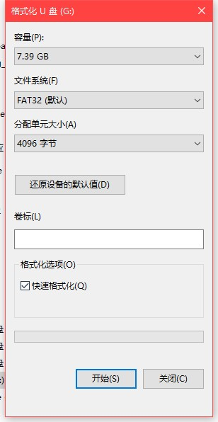
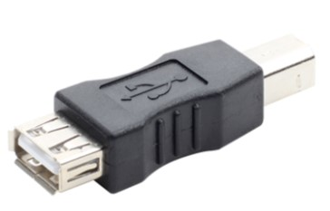

============================
多功能串口数据记录仪硬件手册
============================

.. figure:: _static\overview.jpg
 :align: center

--------------
接口
--------------
 |device| 右侧接口分别为：
        
        - 按键
        - SD卡槽
        - USB B型接口

 |device| 左侧接口分别为：

        - 9~24Vdc 供电接口
        - 9Pin兼容RS232协议的通信接口

                1. 继电器COM端/OD输出
                2. RS232 TX
                3. RS232 RX
                4. 继电器常开常闭/GND
                5. GND
                6. TTL RX
                7. TTL TX
                8. RS485 B
                9. RS485 A

.. note::
        1,4 脚的功能依据具体设备型号尾号不同，可以选择为：

                A. SERLGR-ro: 1 - 继电器COM端   4 - 继电器常开
                B. SERLGR-rc: 1 - 继电器COM端   4 - 继电器常闭
                C. SERLGR-on: 1 - NPN OD端   4 - GND
               
        继电器参数为：

        .. figure:: _static/relay_parameter.jpg
         :align: center

.. warning::
        由于通信接口使用兼容RS232协议的DB9，所以其他功能端子也通过DB9的除2，3，5脚之外的其他引脚引出。必要时，可以使用RS232免焊接扩展模块进行扩展使用。

        .. figure:: _static/rs232_extend.jpg
         :align: center

-------------
工作模式
-------------
 |device| 共有3种工作模式：设置模式，记录模式，读取模式。

^^^^^^^^^^^^^^^^^^
设置模式
^^^^^^^^^^^^^^^^^^
 设置模式下，连接USB至PC，将在PC端增加新的串口设备，通过该串口可以对 |device| 进行设置。 所有设置信息记录至EEPROM。

""""""""""""""""""""""
进入方法
""""""""""""""""""""""
 设备重启或上电时，SD卡未插入卡槽。

""""""""""""""""""""""
指示灯
""""""""""""""""""""""
 模式指示灯显示为 红色

""""""""""""""""""""""
设置方法和指令
""""""""""""""""""""""

**连接设备**

 1. 按照上述方法连接 |device|, 并确保进入设置模式
 2. 安装驱动程序。 Win7系统请下载： :download:`Win7串口驱动 <../_static/drivers.zip>` 。Win10系统免安装
 3. 使用secureCRT 或其他串口工具连接新增加的串口。 通信参数为： 38400 8N1
 4. 输入指令

**设置指令**
 请参考 `多功能串口记录仪配置参考`_

^^^^^^^^^^^^^^^^^^
记录模式
^^^^^^^^^^^^^^^^^^
 记录模式下， |device| 首先从EEPROM中，获取串口设置，接着判断 SD卡中是否存在配置文件 config.ini，如果存在，则使用SD卡中的配置。

""""""""""""""""""""""
进入方法
""""""""""""""""""""""
 设备重启或上电时，SD卡插入卡槽，且按键未被按下。

""""""""""""""""""""""
指示灯
""""""""""""""""""""""
 模式指示灯显示为 绿色

""""""""""""""""""""""
配置文件
""""""""""""""""""""""
 请参考 `_多功能串口记录仪配置参考`

^^^^^^^^^^^^^^^^^^
读取模式
^^^^^^^^^^^^^^^^^^
 读取模式下，通过连接USB到PC，将在PC端显示为U盘存储设备。通过改设备可以修改SD卡中的配置文件，也可以操作数据记录文件。 

""""""""""""""""""""""
进入方法
""""""""""""""""""""""
 设备重启或上电时，SD卡插入卡槽，且按键被按下。

""""""""""""""""""""""
指示灯
""""""""""""""""""""""
 模式指示灯显示为 蓝色

.. note::
        依据不同SD卡的速度，在PC端生成存储设备的时间也有不同。

-------------
SD卡初始化
-------------
 如果需要长时间记录数据，推荐使用 ``宽温度范围，SLC工艺的工业SD卡`` 。 比如Apacer,Transcend,InnoDisk,SolidGear。

        .. figure:: _static\industrial_sd.jpg
         :align: center

 |device| 最大支持32GB的SD卡。在插入 |device| 前，务必格式化成 FAT32格式。

--------------
供电与取电
--------------
 |device| 左侧供电接口支持 9~24Vdc供电，满足大部分工业使用需求。在使用左侧供电口供电时，右侧USB接口可以输出 5V 2A的电流。对于需要外接其他5V设备的场合，可以从此口取电。

        USB打印机转换头

------------------
智能重启
------------------
 为了方便 |device| 操作，通过按键可以快速重启，以便在3种模式间快速切换。

 在任何一种模式下， 长按按键 3秒，重启指示灯点亮，抬起按键，指示灯闪烁，2秒钟后设备重新启动。在此2秒钟内，需要完成 SD卡或者按键操作，以使 |device| 重启后顺利进入对应模式。

--------------------
文件新建
--------------------
 在记录模式下，短按一次按键， |device| 会关闭当前记录文件，新的数据将新建一个文件进行记录。

--------------------
报警清除
--------------------
 记录模式下，如果发生报警，也可以短按一次按键，使报警复位。

.. note::
        记录模式下，短按一次按键，同时触发 ”文件新建“ 和”报警清除“ 功能。

.. |device| replace:: 多功能串口记录仪
.. |company| replace:: 北京天星智联科技有限公司
