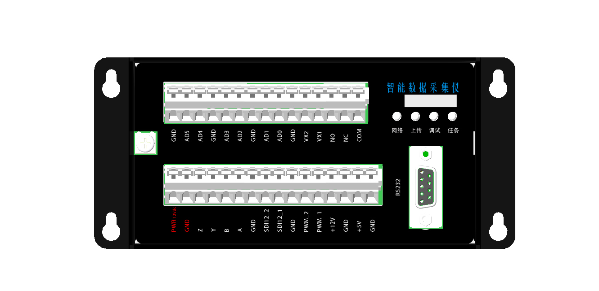
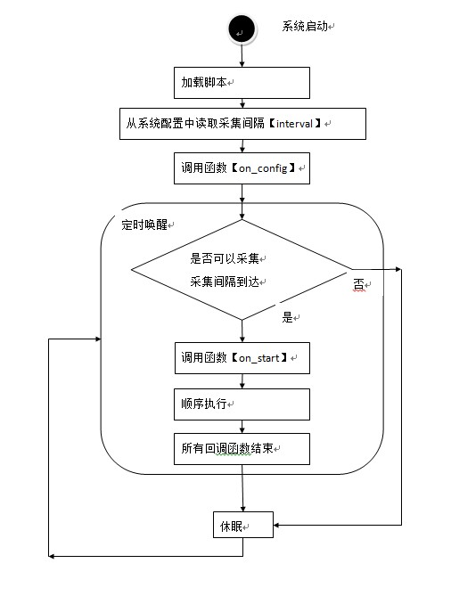

系统一览
===============================
本文档用于说明天星智联智能数据采集相关系列产品的脚本编写方法。最终版权属北京天星智联科技有限公司所有。

.. warning::
        由于固件版本和系统升级而导致的文档不匹配，天星智联科技不单独进行通知。

智能数据采集仪介绍
--------------------------------
SDL-1000系列基站式数据采集仪是一款多用途低功耗的可以二次开发的数据采集采集仪。通过控制脚本，数据采集仪可以测量多数的水文、气象、环境和工业领域的传感器。

数据采集仪可以保存60000条数据采集结果。超过60000条数据后，将自动擦除最先保存的数据。

数据采集仪可以按照预设的时间间隔进行数据采集，也可以按照预设的时间间隔唤醒设备进行数据上传。两种预设间隔独立执行，数据采集仪可以通过多种通信方式将数据上传到指定网站。

SDL-1000系列基站式数据采集仪，根据通信方式不同，包含以下型号：

        ======  =========       =========
        序号    型号            通信方式
        ======  =========       ========= 
        1       SDL-1000W       WIFI
        2       SDL-1000G       GPRS
        3       SDL-1000N       NBIOT
        4       SDL-1000L       LORA
        ======  =========       =========

SDL-1000系列数据采集仪采用统一硬件，独立软件的组织方式，可以有效降低硬件采购成本，提高部署简易度，真正实现一款硬件采集任意多种传感器数据并上传。

硬件安装及电气指标请参考《智能数据采集仪电气说明》。

脚本语法
-----------------------------------
智能数据采集仪运行的脚本采用 **LUA** 语法，参考版本为 `Lua5.2 <http://www.lua.org/manual/5.2/manual.html>`_ 。

Lua脚本的最大文件大小为 **16KB** ，如果文件大小超过长度，将无法正确执行，请删除注释或压缩换行。

脚本不支持io 和 os，请勿引用和使用。

执行过程
-------------------------------------

执行描述

1. 系统上电启动后，会自动加载脚本。如果脚本存在语法错误将无法正确加载。
2. 读取配置参数 ``采集间隔`` 。建议采集间隔大于5秒。
3. 调用函数 ``on_config`` 进行上电后，软件环境初始化。
4. ``扫描间隔`` 到达后，采集仪唤醒，判断是否到达 ``采集间隔`` 。如果到达 ``采集间隔`` 则执行步骤5，否则继续休眠，重复步骤4.
5. 到达 ``采集间隔`` 调用函数 ``on_start`` ,按顺序执行语句，直到函数结束并且所有回调函数结束。
6. 采集仪再次休眠，重复步骤4.

.. warning::
   采集仪不确定每次执行 on_start的总时间，用户需要自行判断，以确保 **执行时间** 小于 ``采集间隔`` ,否则不能保证每次采集点到达时，正确执行 on_start 。 

